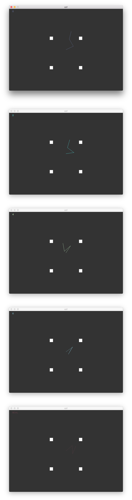

# Robot motion planning: PRM

Juan C. Torres

## Robot arm motion

### Problem 

A robot arm has a certain number of arms `a` (between one and four). Each of this arms moves independently from each other.
We define a configuration as a vector `theta` representing a sequence of angles `(theta_1, theta_2, ..., theta_a)`, 
where `theta_i` represents the angle for the ith arm of the robot with respect to its previous arms, as measured in a 
counterclockwise fashion.
 
We want to plan for a robot arm to move from a particular configuration to another configuration; in other words, we want
to see whether a robot arm can move from having configuration `theta` to having configuration `theta'`. To do so, we must
create intermediate steps (small movements of the robot), check whether the robot arm clashes with any obstacles in this
new configuration, and so on, until we find a path that allows the arm not to clash with any obtacles. I do this by 
first generating a dense graph of configurations, and then framing the problem as a search problem where there is a 
start state (a particular configuration `theta`) and I want to reach a goal state (another configuration `theta'`) by 
traversing the graph. If there is a path between `theta` and `theta'`, then we can plan for the robot arm to move from 
the start state to the end state by taking that path; otherwise, the robot arm cannot move between the start and goal 
states.

### Kinematics: translating from configuration space to physical space

Given a configuration vector `theta`, obtaining the endpoints of each in physical space is done as follows:

```
x1 = l1 * cos(theta_1)
x2 = x1 + l2 * cos(theta_1 + theta_2)
x3 = x2 + l3 * cos(theta_1 + theta_2 + theta_3)
...
```

```
y1 = l1 * cos(theta_1)
y2 = y2 + l2 * cos(theta_1 + theta_2)
...
```
I accomplish this in my code by calling the `angles_to_x_y` function, which returns a list of `(x, y)` tuples, where
the tuple at position `i` represents the endpoint of arm `i`.

```python
def angles_to_x_y(self, angles) -> list:
    res = []
    for i in range(len(angles)):
        prev_angles = [angles[j] for j in range(i + 1)]
        prev_x, prev_y = res[i - 1] if i > 0 else (0, 0)
        x_res = prev_x + (self.l * cos(sum(prev_angles)))
        y_res = prev_y + (self.l * sin(sum(prev_angles)))
        res.append((x_res, y_res))
    return res
```


Notice that this is not the most convenient representation for creating robot arms (lines) and checking for collisions.
To do so, I implemented `def get_endpoints_with_start` and `get_line_coordinates`, which together trasnform the previously
mentioned tuples into a list of coordinates for segments (which represent the robot arms). Each segment is represented
by four coordinates, `(x1, y1, x2, y2)`.

### Populating the graph

#### Generating possible states

In order to be able to frame this problem as a graph search problem, I needed to generate a graph. I did so as follows:
each node in the graph is a state of the robot arm, i.e., a configuration `theta`. I pre-generated the states in the 
graph randomly. The number of states I generated depends on the number of robot arms.

After some experimentation, the formula number of states I used to generate the number of states is: 

`max(min(self.num_arms ** 7, 1000), 50)`, where `self.num_arms` refers to `a`, the number of arms the robot has. 
Some intuition behind the formula: the basic formula is `a ^ 7`. After playing with several configurations, it seemed 
having over 1000 states did not significantly help the search, so I created an upper limit of 1000 states. I make sure to
create at least 50 states because this formula did not work well with problems where the robot has 1 arm; after all, `1 ^ 7`
is `1`.

#### Generating edges in the graph

After generating all possible states, I create an edge between an edge and its `k` closest neighbors. I do this by 
getting the angular distance between a configuration state and every other state in the graph and sorting in ascending 
order. The closest `k` neighbors are then connected to the vertex for this state in the graph.

##### Calculating angular distances

I was careful to calculate the angular distances between two angles as the shortest of the two distances when measuring
angles on a unit circle: I consider both clockwise and counterclockwise distances and choose the shorter one of the two.
I test this by calling `assert 0 <= dist <= pi` on every call. For details, please see the `get_angular_dist` and 
`get_config_dist` functions.

#### Choosing the parameters

After running some tests, it seems that choosing a higher `k` generates a solution with fewer steps, and it leads to 
finding solutions a higher percentage of times; it also leads to higher runtimes, however. This makes sense, for several
reasons:

* A more densely populated graph will have more paths between a start and a goal state, which makes it more likely the 
PRM can find a solution. This also means that, even if for a lower `k` there were paths between a state and another state,
a higher `k` is more likely to generate shorter paths between the 2 states.

* A more densely populated graph will have a higher runtime, since the runtime for BFS is `O(V + E)`, where `E` is the 
number of edges. The more edges, the higher the runtime.

### Searching for a path

To search for a path between `start` and `goal`, I use BFS.

#### Filtering invalid neighbors

When I generated the graph, I created an edge between a vertex and its `k` closest neighbors. Not all of these movements
will be valid. At the time of running BFS, for every possible traversal between a state `theta` and a neighbor `theta'`,
 I check for validity. 
 I do so by sampling the **physical** space between the two configurations. If there is a collision between any
of the robot arms in any of the states in the sampling and an obstacle, then the transition between `theta` and `theta'` 
is invalid and the search down that path cannot continue.

To sample the space between `theta` and `theta'`, I sample a fixed number of intermediate steps. The fixed number is 
defined by `self.step_count`, which the user can set.

```python
def is_valid_transition(self, config1: List, config2: List):
    assert len(config1) == len(config2)
    res = []
    for i in range(len(config1)):
        # Define a range of angles to create a sampling on:
        # The sampling will have `step_count` steps between `range_start` and `range_stop`
        # `range_start` is the smallest of the two; range_stop is whichever `range_start` is not.
        range_start = min(config1[i], config2[i])
        range_stop = config2[i] if (range_start == config1[i]) else config1[i]
        assert range_start != range_stop

        step_size = (range_stop - range_start) / self.step_count
        vals = [range_start + j * step_size for j in range(self.step_count)]
        res.append(vals)

    all_configs = [config1] + list(zip(*res)) + [config2]  # [theta, intermediate configs, theta']
    endpoint_list_all_configs = [self.angles_to_x_y(config_intermediate) for config_intermediate in all_configs]
    endpoint_list_all_configs = [[[0] * 2] + xy for xy in endpoint_list_all_configs]
    for endpoint_list in endpoint_list_all_configs:
        line_coords = [endpoint_list[i: i + 2] for i in range(len(endpoint_list) - 1)]
        lines = [LineString(coord) for coord in line_coords]
        if any([l.intersects(p) for l in lines for p in self.obstacles]):
            return False
    return True
```


#### Choosing the parameters

It might be worth exploring in the future a way to tie `step_count` to either `k`, the distance between the 
start and end configurations configurations `theta` and `theta'`, or the size of the obstacles. Doing so might improve
collision detection:

* Tying it to `k` or the distance between two configurations: 
the larger `k` is, the more neighbors a configuration will have and, therefore, the larger the 
distances between two configurations could be. Always taking 50 or 100 will result in different step sizes between 
configurations that are close and configurations that are far from each other. For instance, 50 steps between 1 and 2 
results in a step size of 0.02, but 50 steps between 1 and 3 results in a step size of 0.04. The latter will be more 
likely to miss collisions between obstacles.

* In a similar fashion, smaller obstacles will be more difficult to detect because they are more likely to be missed by 
sampling methods.

### Tests

For some of the tests, given the high number of steps, I included a video file instead of screenshots. These can be
found in `report/media/1/`
#### Test 1
`obstacles=obstacles[1]`, `k=15`, `step_count=50`
 


#### Test 2

`obstacles=obstacles[0]`, `k=5`, `step_count=20`

See ex2.mp4 for an animated diagram.

#### Other tests

For more tests, see ex3.mp4 and others in `report/media/1/`. These were all generated with `k=5` and `step_count=20`.
The initial and goal configurations were generated randomly.
